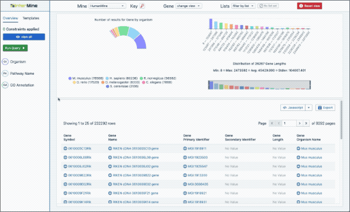
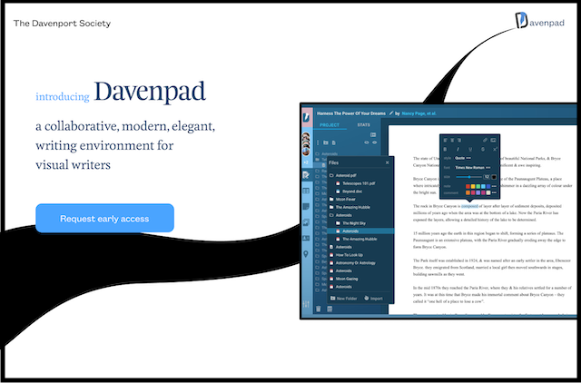
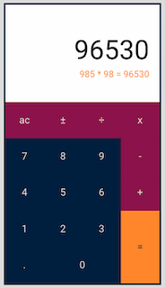
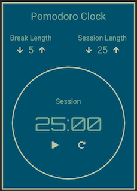

 
 

<a href="https://www.linkedin.com/in/johnmanuelmendez/">
  
  johnmanuelmendez
</a>

 

<a href="https://twitter.com/joan_manuel_bk">
  
  joan_manuel_bk
</a>

 
 

I'm Jóan, pronounced as John, and I'm a filmmaker/actor/screenwriter transitioning into software engineering. I'm entirely self-taught, and that's been my jam since I first taught myself how to speak english as a 7 year old. I love solving problems using code, and perform best with full autonomy. I prefer to own my mistakes as much as I own my successes.

Here's a bit of what I've been up to:

### 📈 Outreachy Internship working with Intermine/Univ of Cambridge

I was selected to overhaul their entire data browser webapp. It was an incredible experience, where I was tasked to design, and develop their webapp according to their specifications. Up till then I was a cowboy developer, so I'm grateful for the opportunity to have worked with a team, and iterate over requirements.

Built with react, xstate, emotion, and sass
[live demo](https://intermine-data-browser.netlify.app/) | [source](https://github.com/JM-Mendez/InterMine-Data-Browser-Tool)

### 📝 Davenpad

This is a collaborative writing environment for visual writers. As a screenwriter, visuals are very inspiring for setting tone and mood. I haven't come across other writing apps that suited me, so I started to build one. Collaboration does not use operational transformations like google docs, because when collaborating on stories, individual edits aren't as important as the context for changes.

Being built with a heavily modified fork of draftjs, react, redux, and typescript. Although after gaining experience using state machines during my internship, I will most likely refactor redux out. I'm also redesigning it, since the original design was limited by my naivety back in 2017.

### ✨ Freecodecamp projects

A selection of projects that I built while learning how to code. All built with react, typescript, and sometimes redux.

  
Javascript Calculator

  

    <a href="https://fcc-jm-projects.gitlab.io/javascript-calculator/">live demo</a>
     | 
    <a href="https://gitlab.com/fcc-jm-projects/javascript-calculator">source</a>
  

  

  
Pomodoro clock

  

    <a href="https://fcc-jm-projects.gitlab.io/pomodoro-clock/">live demo</a>
     | 
    <a href="https://gitlab.com/fcc-jm-projects/pomodoro-clock">source</a>
  

  

#### Some more

- Drum Machine | [live demo](https://fcc-jm-projects.gitlab.io/drum-machine/) | [source](https://gitlab.com/fcc-jm-projects/drum-machine)

- Markdown Previewer | [live demo](https://fcc-jm-projects.gitlab.io/markdown-previewer/) | [source](https://gitlab.com/fcc-jm-projects/markdown-previewer)

- Random quote machine | [live demo](https://fcc-jm-projects.gitlab.io/random-quote-machine/) | [source](https://gitlab.com/fcc-jm-projects/random-quote-machine)

###
